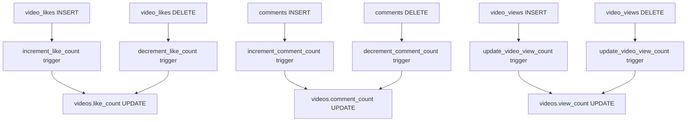

# Design Document

## Overview

This design addresses critical database integrity issues in the video platform by implementing a comprehensive solution that fixes like counts, follow relationships, comment counts, view tracking, and resolves Supabase security warnings. The solution focuses on moving data consistency logic from the frontend to the database layer using triggers and properly secured functions.

## Architecture

### Current Issues Analysis
1. **Security**: Functions lack proper search_path settings causing 21 mutable search path warnings
2. **Data Consistency**: Frontend manually manages counts leading to sync issues
3. **Race Conditions**: Concurrent operations can cause duplicate entries or incorrect counts
4. **Performance**: Multiple database calls for single operations

### Proposed Architecture
- **Database-First Approach**: Move all count management to database triggers
- **Atomic Operations**: Use database transactions for consistency
- **Secure Functions**: Implement proper search_path settings for all functions
- **Frontend Simplification**: Remove manual count management from React components

## Components and Interfaces

### 1. Database Security Layer

#### Search Path Security Functions
```sql
-- Template for all secure functions
CREATE OR REPLACE FUNCTION secure_function_template()
RETURNS return_type AS $$
BEGIN
  -- Set search_path for security
  PERFORM set_config('search_path', 'public', true);
  
  -- Function logic here
END;
$$ LANGUAGE plpgsql SECURITY DEFINER;
```

#### Functions to Update
- `record_video_view(video_uuid UUID)`
- `get_genuine_view_count(video_uuid UUID)`
- `update_video_view_count()`
- All like count management functions
- All follow relationship functions

### 2. Like Management System

#### Database Schema
```sql
-- Existing table: video_likes
-- Columns: id, video_id, user_id, created_at
```

#### Trigger Functions
```sql
-- Increment like count
CREATE OR REPLACE FUNCTION increment_like_count()
RETURNS TRIGGER AS $$
BEGIN
  PERFORM set_config('search_path', 'public', true);
  
  UPDATE public.videos 
  SET like_count = COALESCE(like_count, 0) + 1
  WHERE id = NEW.video_id;
  
  RETURN NEW;
END;
$$ LANGUAGE plpgsql SECURITY DEFINER;

-- Decrement like count
CREATE OR REPLACE FUNCTION decrement_like_count()
RETURNS TRIGGER AS $$
BEGIN
  PERFORM set_config('search_path', 'public', true);
  
  UPDATE public.videos 
  SET like_count = GREATEST(COALESCE(like_count, 0) - 1, 0)
  WHERE id = OLD.video_id;
  
  RETURN OLD;
END;
$$ LANGUAGE plpgsql SECURITY DEFINER;
```

#### Frontend Interface
```typescript
// Simplified like handling - no manual count management
const handleLike = async (videoId: string) => {
  if (!user) return;
  
  const { data: existingLike } = await supabase
    .from('video_likes')
    .select('*')
    .eq('video_id', videoId)
    .eq('user_id', user.id)
    .single();

  if (existingLike) {
    await supabase
      .from('video_likes')
      .delete()
      .eq('video_id', videoId)
      .eq('user_id', user.id);
  } else {
    await supabase
      .from('video_likes')
      .insert({ video_id: videoId, user_id: user.id });
  }
  
  // Counts updated automatically by triggers
};
```

### 3. Comment Count Management

#### Trigger Functions
```sql
-- Increment comment count
CREATE OR REPLACE FUNCTION increment_comment_count()
RETURNS TRIGGER AS $$
BEGIN
  PERFORM set_config('search_path', 'public', true);
  
  UPDATE public.videos 
  SET comment_count = COALESCE(comment_count, 0) + 1
  WHERE id = NEW.video_id;
  
  RETURN NEW;
END;
$$ LANGUAGE plpgsql SECURITY DEFINER;

-- Decrement comment count
CREATE OR REPLACE FUNCTION decrement_comment_count()
RETURNS TRIGGER AS $$
BEGIN
  PERFORM set_config('search_path', 'public', true);
  
  UPDATE public.videos 
  SET comment_count = GREATEST(COALESCE(comment_count, 0) - 1, 0)
  WHERE id = OLD.video_id;
  
  RETURN OLD;
END;
$$ LANGUAGE plpgsql SECURITY DEFINER;
```

### 4. View Count System

#### Enhanced View Recording
```sql
CREATE OR REPLACE FUNCTION record_video_view(video_uuid UUID)
RETURNS void AS $$
DECLARE
  video_creator_id UUID;
  current_user_id UUID;
BEGIN
  PERFORM set_config('search_path', 'public', true);
  
  current_user_id := auth.uid();
  
  SELECT user_id INTO video_creator_id 
  FROM public.videos 
  WHERE id = video_uuid;
  
  -- Only record view if viewer is not the creator
  IF current_user_id IS NOT NULL AND video_creator_id IS NOT NULL AND current_user_id != video_creator_id THEN
    INSERT INTO public.video_views (video_id, viewer_id, creator_id)
    VALUES (video_uuid, current_user_id, video_creator_id)
    ON CONFLICT (video_id, viewer_id) DO NOTHING;
  END IF;
END;
$$ LANGUAGE plpgsql SECURITY DEFINER;
```

### 5. Follow Relationship Management

#### Secure Follow Functions
```sql
CREATE OR REPLACE FUNCTION handle_follow_relationship(target_user_id UUID, action TEXT)
RETURNS BOOLEAN AS $$
DECLARE
  current_user_id UUID;
  existing_follow_id UUID;
BEGIN
  PERFORM set_config('search_path', 'public', true);
  
  current_user_id := auth.uid();
  
  IF current_user_id IS NULL OR current_user_id = target_user_id THEN
    RETURN FALSE;
  END IF;
  
  SELECT id INTO existing_follow_id
  FROM public.follows
  WHERE follower_id = current_user_id AND following_id = target_user_id;
  
  IF action = 'follow' AND existing_follow_id IS NULL THEN
    INSERT INTO public.follows (follower_id, following_id)
    VALUES (current_user_id, target_user_id);
    RETURN TRUE;
  ELSIF action = 'unfollow' AND existing_follow_id IS NOT NULL THEN
    DELETE FROM public.follows WHERE id = existing_follow_id;
    RETURN FALSE;
  END IF;
  
  RETURN (existing_follow_id IS NOT NULL);
END;
$$ LANGUAGE plpgsql SECURITY DEFINER;
```

### 6. Frontend Component Updates

#### VideoPlayer Component Changes
- Remove manual like count updates
- Remove manual follow status management
- Simplify interaction handlers
- Add proper error handling

#### ModalVerticalFeed Component Changes
- Remove manual count management
- Implement real-time data updates
- Simplify state management

## Data Models

### Updated Video Model
```typescript
interface Video {
  id: string;
  title: string;
  description?: string;
  video_url: string;
  thumbnail_url?: string;
  duration?: number;
  view_count: number;      // Auto-managed by triggers
  like_count: number;      // Auto-managed by triggers
  comment_count: number;   // Auto-managed by triggers
  user_id: string;
  created_at: string;
  profiles?: {
    username: string;
    avatar_url?: string;
  };
}
```

### Database Trigger Dependencies


## Error Handling

### Database Level
- Use `GREATEST()` function to prevent negative counts
- Handle constraint violations gracefully
- Use `ON CONFLICT DO NOTHING` for duplicate prevention
- Implement proper transaction rollback

### Frontend Level
- Remove manual count synchronization
- Add loading states for interactions
- Implement optimistic UI updates
- Handle network errors gracefully

### Security Measures
- All functions use `SECURITY DEFINER` with fixed search_path
- Validate user authentication in all functions
- Prevent self-following and self-view counting
- Use parameterized queries to prevent injection

## Testing Strategy

### Database Testing
1. **Trigger Testing**: Verify all triggers fire correctly
2. **Concurrency Testing**: Test simultaneous operations
3. **Security Testing**: Verify search_path settings
4. **Data Integrity**: Test count accuracy after operations

### Frontend Testing
1. **Integration Testing**: Test database interaction
2. **UI Testing**: Verify count updates in components
3. **Error Handling**: Test network failure scenarios
4. **Performance Testing**: Measure response times

### Migration Testing
1. **Backup Verification**: Ensure data can be restored
2. **Rollback Testing**: Test migration reversal
3. **Data Migration**: Verify existing data integrity
4. **Function Testing**: Test all updated functions

## Performance Considerations

### Database Optimizations
- Use efficient trigger functions
- Minimize database calls from frontend
- Implement proper indexing for count queries
- Use batch operations where possible

### Frontend Optimizations
- Remove redundant state management
- Implement proper caching strategies
- Use optimistic updates for better UX
- Minimize re-renders on count changes

## Migration Strategy

### Phase 1: Database Security Fix
1. Update all functions with proper search_path
2. Test function execution
3. Verify warning elimination

### Phase 2: Trigger Implementation
1. Create/update all trigger functions
2. Create triggers for like, comment, view counts
3. Test trigger functionality

### Phase 3: Data Reconciliation
1. Recalculate all existing counts
2. Verify data accuracy
3. Update any inconsistent records

### Phase 4: Frontend Updates
1. Remove manual count management
2. Simplify interaction handlers
3. Test UI functionality
4. Deploy changes